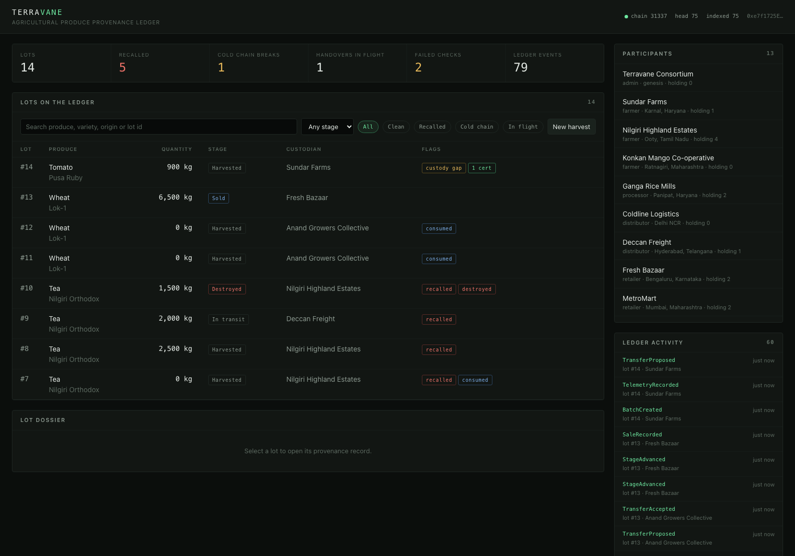
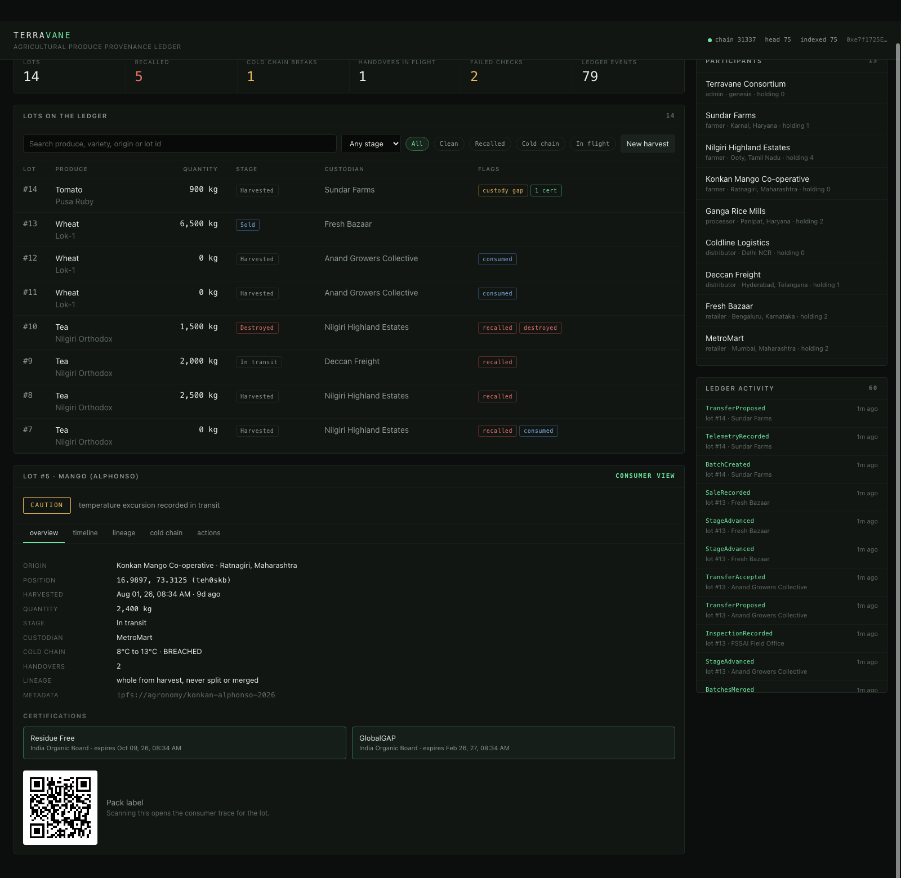
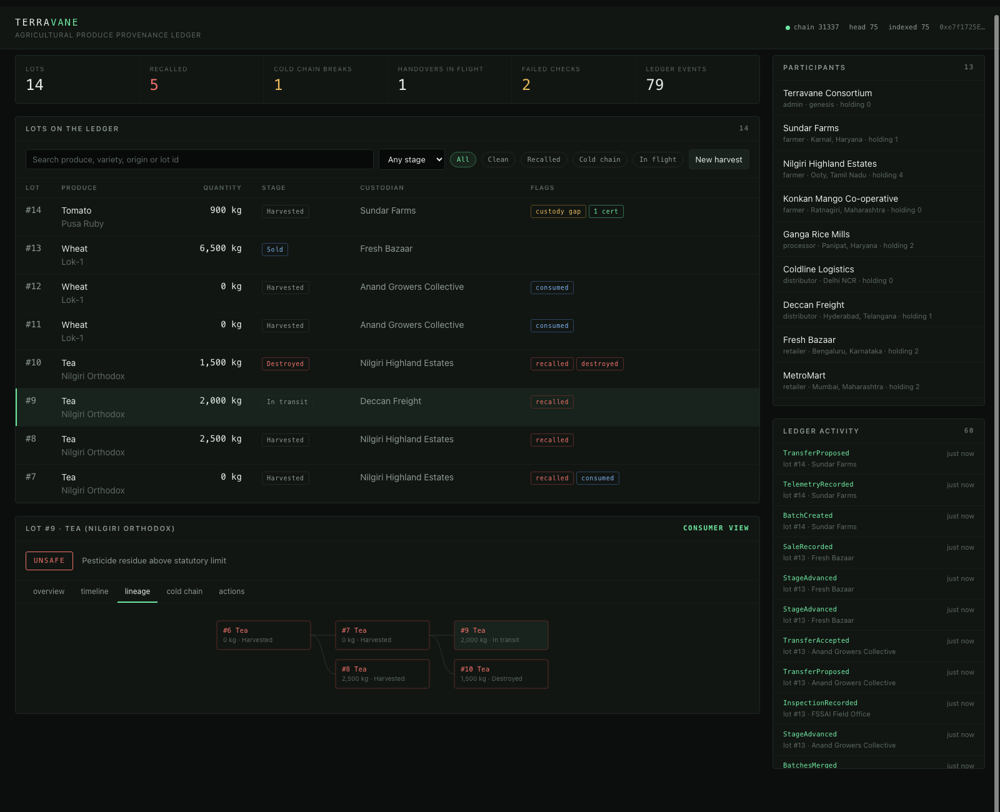
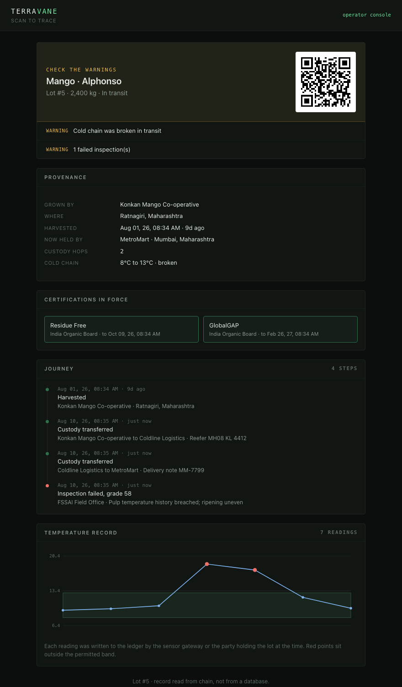

# Terravane

[](https://github.com/DarkKnight091/terravane/actions/workflows/ci.yml)
[](LICENSE)

A permissioned provenance ledger for agricultural produce. A lot is minted at the
farm gate, changes hands under countersigned custody transfers, splits and merges
as it is processed, carries certifications and inspection results, streams
cold-chain telemetry, and can be recalled through every descendant lot it ever
became. A shopper scans the QR code on the packet and gets the whole record.

Two Solidity contracts, an event indexer, a REST API, an operator console and a
consumer trace page. Everything runs locally against a Hardhat chain.



## Quick start

```bash
npm install
npm run stack        # compile, chain, deploy, seed, serve
```

Then open <http://localhost:4300> for the operator console, or
<http://localhost:4300/trace.html?id=5> for what a shopper sees. Add `--fresh` to
wipe the previous index and deployment before starting.

```bash
npm test             # 58 contract tests
npm run size         # contract sizes against the 24,576 byte deployment limit
node scripts/smoke.js  # 30 end to end checks against a running stack
```

## The problem this shape solves

Food fraud and food recalls are both custody problems. A crate of mangoes passes
through five hands, and by the time somebody is poisoned nobody can say which
farm, which reefer, or which of the forty sub-lots that consignment became. Paper
trails are reconciled after the fact by the parties with the most to lose from an
honest answer.

Putting it on a permissioned chain does not make anyone honest. What it does is
make the record append-only, make every claim attributable to a licensed party,
and make the recall reach computable in seconds instead of days.

## What is on chain

Two contracts, no external dependencies.

**`AccessRegistry`** decides who may do what. Participants hold a role bitmask
(farmer, processor, distributor, retailer, certifier, inspector, oracle, admin),
because a co-operative is routinely two of those at once and a mapping per role
would cost a storage slot each. Admins enrol, grant, revoke and suspend.

**`ProduceRegistry`** is the ledger itself.

| Concern | How it works |
| --- | --- |
| Origination | Only an active farmer mints a lot: quantity, unit, variety, harvest time, origin geohash, and a digest of the off-chain agronomy record. |
| Custody | Two steps. The holder proposes, the recipient countersigns. Recipients must hold a role that can legally take produce. |
| Lifecycle | `Harvested → Processed → Packed → InTransit → AtRetail`, monotonic, each step gated on the custodian holding the role that step requires. Sale and destruction have their own entry points because they carry extra evidence. |
| Transformation | `splitBatch` requires the children to account for the parent exactly. `mergeBatches` refuses to mix produce types or units, and cannot count the same lot twice. |
| Cold chain | A lot may declare a permitted temperature band. The contract decides whether a reading is an excursion, and the breach latches. |
| Certification | Certifiers attach schemes to a lot or to a farm, with expiry, evidence URI and digest. Revocation is recorded with a reason, never deleted. |
| Inspection | Inspectors record a 0 to 100 grade, a pass flag, findings and a report digest. |
| Recall | Inspectors, admins or the originating farm can pull a lot. Propagation to derived lots is caller-supplied and contract-verified. |
| Consumer answer | `verify(batchId)` returns one flat struct: recalled, cold chain breached, custody intact, active certifications, failed inspections, chain length. |

### Six decisions worth explaining

**Custody moves in two steps.** A one-step push would let a distributor dump a
spoiled lot onto a retailer who never agreed to take it, and liability would move
with it. The recipient countersigns or the lot stays where it is. An unsettled
handover shows up in the index as a custody gap, which is exactly the state a
regulator wants to see.

**A split must account for its parent exactly, and a merge cannot double count.**
Unexplained shrinkage is the fraud this exists to stop, and inflation is the same
fraud pointing the other way. The merge consumes each input in the same pass that
counts it, so a lot id repeated in the input reads as zero on its second visit and
is rejected. Quantity is never created.

**The contract decides what an excursion is, not the reporter.** A gateway pushes a
temperature and the contract compares it against the band the lot declared at
harvest. Once breached, the flag latches. A later good reading cannot scrub the
record, and a merged lot inherits the worst history of its inputs.

**Recall propagation is proposed off chain and proved on chain.** Crawling a
descendant tree on chain is unbounded gas. Instead the indexer computes the
descendant closure and the contract re-proves that every lot in the call really
descends from the recalled root before marking it, walking the parent links up to a
bounded depth. An operator cannot freeze an unrelated competitor's lot.

**Lineage is stored in both directions.** A recall walks downward and an audit walks
upward. Deriving either direction from the other costs a scan nobody can afford, so
both edges are written at transformation time.

**The registry can never lose its last admin.** The count tracks admins that both
hold the role and are in good standing. Counting the role alone would let two
suspended admins stand in for a live one, and a chain with nobody able to enrol or
reinstate anyone is a dead chain.

### Tests

58 tests across the access model, origination, custody, lifecycle, telemetry,
certification, transformation, recall and pause. They assert the refusals as hard
as the happy paths: non-custodian transfers, unfit recipients, backwards stages,
unaccounted splits, duplicated merge inputs, non-descendant recall propagation,
out-of-range grades, and the last-admin lockout.

`ProduceRegistry` compiles to 23,888 bytes of deployed bytecode against the
24,576 byte limit, with the optimizer at `runs: 1` and `viaIR` enabled.
`npm run size` fails the build if that headroom is ever spent.

## Off chain

**Indexer.** Backfills and then polls contract logs into SQLite. The database is an
index and never the record: whenever an event touches a lot, that lot is re-read
straight from the contract rather than patched from the event payload, so the index
cannot drift into a lie. Delete `data/` and it rebuilds from the chain.

**API.**

```
GET  /api/health                    chain head, indexed block, signing status
GET  /api/stats                     counts by stage, produce and flag
GET  /api/batches?q=&stage=&flag=   flag: clean | recalled | breached | open
GET  /api/batches/:id               full dossier, read from chain
GET  /api/batches/:id/lineage       parents and children as a graph
GET  /api/batches/:id/descendants   what a recall would have to reach
GET  /api/trace/:id                 the consumer answer, with a verdict
GET  /api/qr/:id                    SVG QR pointing at the trace page
GET  /api/events?limit=&batch=      decoded ledger activity
```

Write endpoints live under `/api/actions/*` and cover harvest, transfer, accept,
cancel, stage, telemetry, certify, inspect, split, merge, sell, recall, destroy and
pause. Reverts are decoded back to the contract's error name, so a rejected action
reads `NotCustodian` rather than `execution reverted`.

**Signing.** The server holds the standard Hardhat development keys so the console
can act as any participant without a browser wallet. That is only defensible
against a local chain, so signing refuses outright unless the RPC endpoint is
loopback, and `TERRAVANE_SIGNING=off` disables it entirely. Against any real
network this path must be replaced with signatures produced on the participant's
own device.

## The interface

The operator console carries fleet statistics, a filterable lot table and a dossier
with five tabs. Lots deep-link as `#lot=5&tab=lineage`.



The lineage tab draws the transformation graph. Below, a tea harvest that failed a
residue test, recalled at the root and propagated through two generations.



The consumer page answers one question in one screen: is there any reason not to
eat this. Verdict, then the warnings behind it, then provenance, certifications in
force, the journey, the temperature record with excursions marked, and how the lot
was made up from its parents.



## Seeded data

`npm run seed` drives five threads through the contracts so nothing in the console
is a placeholder:

1. Basmati from Karnal, milled at Panipat, split three ways, two lots retailed and partly sold.
2. Alphonso mangoes under an 8 to 13 degree band, with a reefer failure near Pune that latches a breach and a failed inspection at the far end.
3. Nilgiri tea that fails a residue test, is recalled at severity 3, propagates through two generations of descendants, and has one lot destroyed under supervision.
4. A co-operative that both grows and processes, merging two wheat lots and selling the blend out.
5. A handover offered and never countersigned, so the console has a live custody gap to show.

## Layout

```
contracts/   AccessRegistry, ProduceRegistry, IAccessRegistry
test/        58 mocha tests
scripts/     deploy, seed, stack runner, smoke suite, size gate, shared helpers
server/      SQLite schema, event indexer, read API, write actions
web/         operator console and consumer trace, vanilla ES modules, no build step
```

## Environment

| Variable | Default | Purpose |
| --- | --- | --- |
| `TERRAVANE_RPC` | `http://127.0.0.1:8545` | Chain endpoint |
| `TERRAVANE_MNEMONIC` | Hardhat dev phrase | Development signer derivation |
| `TERRAVANE_SIGNING` | on for loopback | Set `off` to make the API read only |
| `TERRAVANE_PUBLIC_URL` | request host | Base URL encoded into QR codes |
| `PORT` | `4300` | API and UI port |

## Limits

The contracts are unaudited, off-chain payloads are referenced by digest but never
verified on chain, and telemetry is only as honest as the gateway that reports it.
[SECURITY.md](SECURITY.md) sets out the trust model, the known limitations and the
invariants that count as security bugs if they ever break.

## License

MIT. See [LICENSE](LICENSE).
