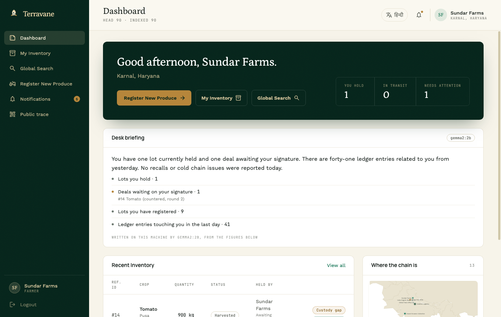
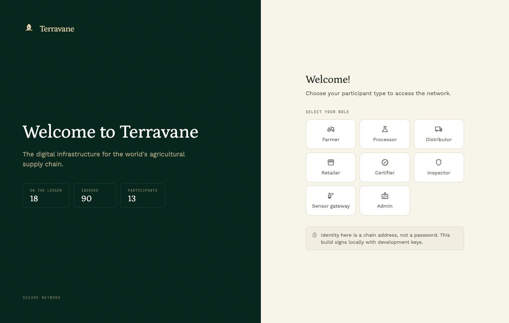
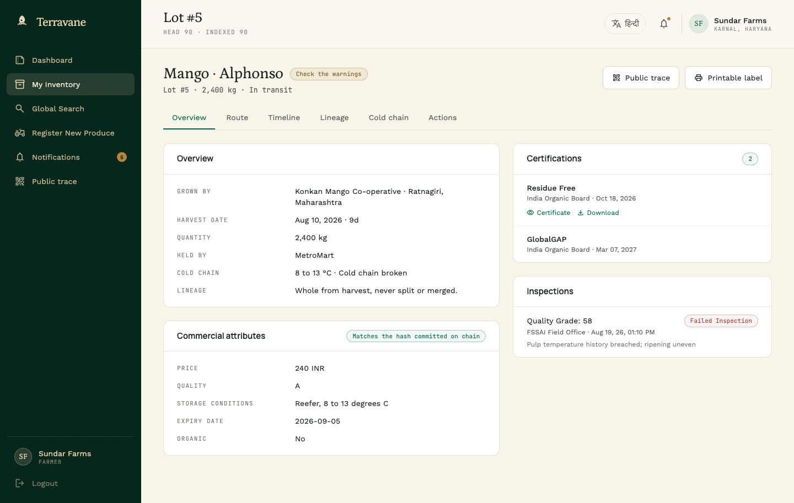
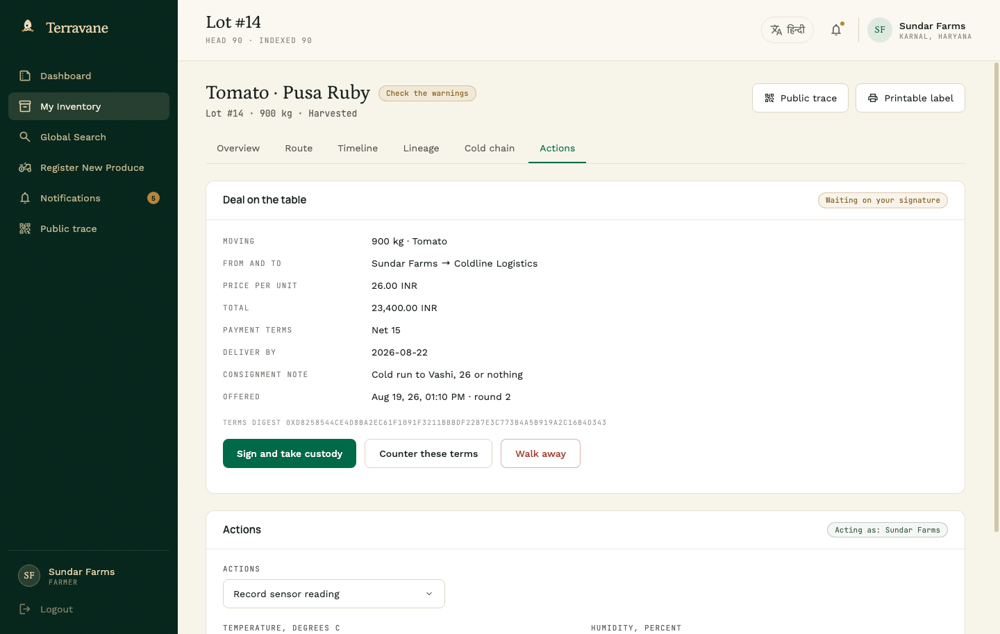
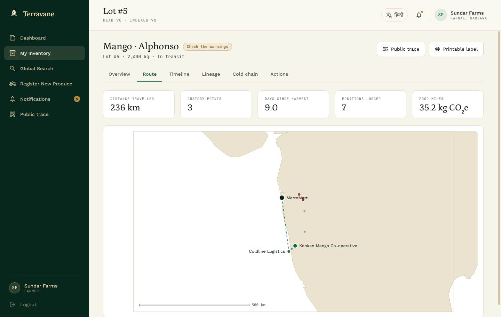
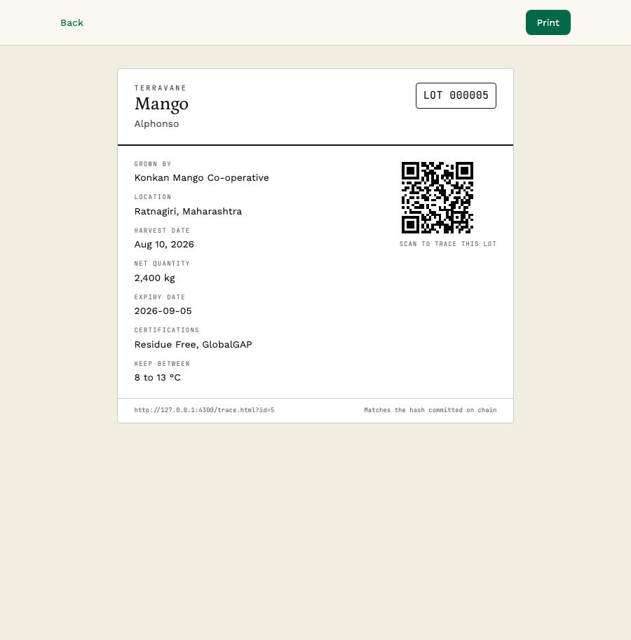

# Terravane

[](https://github.com/amayakavya/terravane/actions/workflows/ci.yml)
[](LICENSE)

A permissioned provenance ledger for agricultural produce, with the working
interface the people in that chain actually use. A lot is minted at the farm gate,
changes hands only when both sides have signed the same deal, splits and merges as
it is processed, carries certifications and inspection results, streams cold-chain
telemetry, and can be recalled through every descendant lot it ever became. Each
settled deal prints its own invoice and each certification its own certificate. A
shopper scans the QR code on the packet and gets the whole record.

Two Solidity contracts, an event indexer, a content-addressed document store, a
REST API, a role-based console in two languages, a public trace page and a
printable pack label. It runs against a local Hardhat chain and makes no requests
to anything outside itself: fonts, icons and map outlines are all served locally,
and the optional desk summary is written by a language model on the same machine.



## Quick start

```bash
npm install
npm run stack        # compile contracts, build CSS, chain, deploy, seed, serve
```

Open <http://localhost:4300>, pick a role and an organisation, and you are in.
Add `--fresh` to wipe the previous index and deployment first.

```bash
npm test             # 65 contract tests
npm run size         # contract sizes against the 24,576 byte deployment limit
npm run smoke        # 80 end to end checks against a running stack
npm run checkui      # loads all 21 pages in a real browser and fails on any error
```

## The problem this shape solves

Food fraud and food recalls are both custody problems. A crate of mangoes passes
through five hands, and by the time somebody is ill nobody can say which farm,
which reefer, or which of the forty sub-lots that consignment became. Paper trails
get reconciled after the fact by the parties with the most to lose from an honest
answer.

Putting it on a permissioned chain does not make anyone honest. What it does is
make the record append-only, make every claim attributable to a licensed party,
and make the recall reach computable in seconds instead of days.

## What is on chain

Two contracts, no external dependencies.

**`AccessRegistry`** decides who may do what. Participants hold a role bitmask
(farmer, processor, distributor, retailer, certifier, inspector, oracle, admin),
because a co-operative is routinely two of those at once and a mapping per role
would cost a storage slot each. Admins enrol, grant, revoke and suspend.

**`ProduceRegistry`** is the ledger itself.

| Concern | How it works |
| --- | --- |
| Origination | Only an active farmer mints a lot: quantity, unit, variety, harvest time, origin geohash, and a digest of the off-chain record. |
| Custody | A bilateral handshake. The holder offers a lot on stated terms, and the receiving side either countersigns the identical terms digest, answers with its own, or walks away. Recipients must hold a role that can legally take produce. |
| Lifecycle | `Harvested → Processed → Packed → InTransit → AtRetail`, monotonic, each step gated on the custodian holding the role that step requires. Sale and destruction have their own entry points because they carry extra evidence. |
| Transformation | `splitBatch` requires the children to account for the parent exactly. `mergeBatches` refuses to mix produce types or units, and cannot count the same lot twice. |
| Cold chain | A lot may declare a permitted temperature band. The contract decides whether a reading is an excursion, and the breach latches. |
| Certification | Certifiers attach schemes to a lot or to a farm, with expiry, evidence URI and digest. Revocation is recorded with a reason, never deleted. |
| Inspection | Inspectors record a 0 to 100 grade, a pass flag, findings and a report digest. |
| Recall | Inspectors, admins or the originating farm can pull a lot. Propagation to derived lots is caller-supplied and contract-verified. |
| Consumer answer | `verify(batchId)` returns one flat struct: recalled, cold chain breached, custody intact, active certifications, failed inspections, chain length. |

### Seven decisions worth explaining

**Custody moves on a handshake, and the handshake is over a deal.** A one-step
push would let a distributor dump a spoiled lot onto a retailer who never agreed
to take it, and liability would move with it. So an offer carries the digest of a
deal document — quantity, price, payment and delivery terms — and the lot moves
only when the other side signs that exact digest. They may instead counter with
their own terms, which swaps whose signature is outstanding without changing
which way the lot would travel; the round counter records how many passes it
took. Signing a digest that has since been countered is refused rather than
quietly upgraded, so nobody is ever bound to terms they did not read. An
unsettled deal, at any round, shows up as a custody gap, which is exactly the
state a regulator wants to see.

Because both signatures land on the same digest, the invoice printed at the end
is rendered from the same bytes the chain committed to, and neither party can
restate the bargain afterwards.

**A split must account for its parent exactly, and a merge cannot double count.**
Unexplained shrinkage is the fraud this exists to stop, and inflation is the same
fraud pointing the other way. The merge consumes each input in the same pass that
counts it, so a lot id repeated in the input reads as zero on its second visit and
is rejected. Quantity is never created.

**The contract decides what an excursion is, not the reporter.** A gateway pushes a
temperature and the contract compares it against the band the lot declared at
harvest. Once breached, the flag latches. A later good reading cannot scrub the
record, and a merged lot inherits the worst history of its inputs.

**Recall propagation is proposed off chain and proved on chain.** Crawling a
descendant tree on chain is unbounded gas. Instead the indexer computes the
descendant closure and the contract re-proves that every lot in the call really
descends from the recalled root before marking it. An operator cannot freeze an
unrelated competitor's lot.

**Price and grade live off chain, but cannot be restated.** Commercial attributes
do not belong in contract storage: they are long strings and every byte is gas.
They also cannot simply live in a database, or a distributor could quietly change
the grade of a lot after a buyer had seen it. So they are written to a
content-addressed store and the lot commits to the hash. Reading a lot back
recomputes the hash and says plainly whether the attributes still match. Change a
price behind the ledger's back and the interface says so, in red, on the consumer
page.

**Lineage is stored in both directions.** A recall walks downward and an audit
walks upward. Deriving either direction from the other costs a scan nobody can
afford, so both edges are written at transformation time.

**The registry can never lose its last admin.** The count tracks admins that both
hold the role and are in good standing. Counting the role alone would let two
suspended admins stand in for a live one, and a chain with nobody able to enrol or
reinstate anyone is a dead chain.

### Tests

65 tests across the access model, origination, custody, lifecycle, telemetry,
certification, transformation, recall and pause. They assert the refusals as hard
as the happy paths: non-custodian transfers, unfit recipients, backwards stages,
unaccounted splits, duplicated merge inputs, non-descendant recall propagation,
out-of-range grades, a handover with no stated terms, a signature on terms that
were superseded, a counter from the side that is already owed one, and the
last-admin lockout.

`ProduceRegistry` compiles to 23,995 bytes of deployed bytecode against the
24,576 byte limit, with the optimizer at `runs: 1` and `viaIR` enabled. The
handshake fitted only because each modifier now delegates to a private function
instead of inlining its checks at two dozen call sites. `npm run size` fails the
build if that headroom is ever spent.

## Off chain

**Indexer.** Backfills and then polls contract logs into SQLite. The database is an
index and never the record: whenever an event touches a lot, that lot is re-read
straight from the contract rather than patched from the event payload, so the
index cannot drift into a lie. Delete `data/` and it rebuilds from the chain.

On startup the server also compares the deployed contract against what these
sources compile to, and says so loudly if they differ. A chain that persists
across runs will happily serve yesterday's deployment to today's code, and the
first symptom of that pairing is otherwise an unreadable decode error somewhere
deep in a page. `/api/health` reports it as `contractMismatch` and stops
reporting `ok`.

**Document store.** Content-addressed attributes, keyed by the keccak hash of their
canonical serialisation. `POST /api/documents` returns the address, the batch
commits to it, and `GET /api/batches/:id` returns the attributes with a verdict on
whether they still hash to what the chain recorded. Deal terms live here too, and
are what both sides of a handover put their signature to.

**Printed documents.** An invoice and a certificate, each a fixed HTML template in
`server/templates/` with `{{PLACEHOLDER}}` values substituted in. The layout is
never generated: an invoice is a thing an accountant and a buyer's clerk expect to
look the same every time, so only the values change. Substitution is strict — a
placeholder nothing filled throws rather than printing `{{TOTAL}}` where the money
goes. Both files are self-contained, carrying their own styles and an inline QR
back to the lot, because they get emailed and printed on machines that have never
heard of this server. An invoice exists only for a countersigned deal; an offer
nobody accepted is not a sale, and asking for one returns 409.

**Desk briefing, optional.** `GET /api/desk?as=` counts what one participant's desk
is actually carrying — lots held, signatures owed, recalled stock, whatever their
roles make relevant — and returns those figures. Where a local Ollama daemon is
answering, it also returns two or three sentences of English written from exactly
those figures and nothing else. That half is optional in the strict sense: with
`TERRAVANE_AI=off`, with no daemon running, or with the model timing out, the
figures come back unchanged and the console renders them on their own, saying
which of those it is showing. Nothing leaves the machine, and the model is never
asked to do arithmetic — the console prints the counted figures beside its prose,
so a sentence that disagrees with them is visibly wrong rather than quietly
believed.

**API.**

```
GET  /api/health                    chain head, indexed block, readiness
GET  /api/stats                     counts by stage, produce and flag
GET  /api/batches?q=&stage=&flag=   flag: clean | recalled | breached | open
GET  /api/batches/:id               full dossier, read from chain
GET  /api/batches/:id/lineage       parents and children as a graph
GET  /api/batches/:id/descendants   what a recall would have to reach
GET  /api/notifications?as=         the ledger, filtered to one participant
GET  /api/documents/:hash           a committed attribute document
GET  /api/trace/:id                 the consumer answer, with a verdict
GET  /api/qr/:id                    SVG QR pointing at the trace page
GET  /api/desk?as=                  one desk's figures, and prose if a model answers
GET  /api/batches/:id/invoice/:n    the invoice for one countersigned deal
GET  /api/batches/:id/certificate/:n  the certificate for one certification
```

Write endpoints live under `/api/actions/*` and cover harvest, transfer, counter,
accept, cancel, stage, telemetry, certify, inspect, split, merge, sell, recall,
destroy and pause. Reverts are decoded back to the contract's error name, so a rejected action
reads `NotCustodian` rather than `execution reverted`.

**Signing.** The node holds the standard Hardhat development keys so the console
can act as any participant without a browser wallet. That is only defensible
against a local chain, so signing refuses outright unless the RPC endpoint is
loopback, and `TERRAVANE_SIGNING=off` disables it entirely. The sign-in page says
so rather than dressing it up as a login. Against any real network this path must
be replaced with signatures produced on the participant's own device.

## The interface

Sign in by choosing a role and an organisation enrolled on the chain. Every page is
available in English and Hindi.



One dashboard adapts to whichever roles the signed-in participant holds, rather
than four near-identical pages that drift apart. It carries what they hold, what is
in transit, what needs attention, anything waiting on their signature, and the
whole network on a map. Above that sits the desk briefing: the counted state of
their desk, and — where a local model is running — those same figures said back in
a sentence, with the model's name on it so nobody mistakes which half is which.

The lot dossier is six tabs: overview with the committed attributes and their
verdict, the route, the timeline, the lineage graph, the cold chain, and the
actions this participant is actually allowed to take on this lot.



A lot with a deal open shows it to both sides before anything is signed: what is
moving, between whom, at what price, on what payment and delivery terms, and how
many rounds of counter-offer it has taken. Whoever owes the signature gets the
buttons; whoever is waiting is told who they are waiting on. The terms are always
shown in full, because signing a digest whose contents you were never shown is not
agreement, it is a formality.



Once a deal is countersigned, its invoice is one click from the timeline, and
every certification on a lot issues its own certificate the same way. Both open in
a tab to be read or download as a single self-contained file to be kept.

The route tab puts a lot's custody trail on a map, with distance travelled, days
since harvest and every sensor reading in place. Excursions are the red points.



The lineage tab draws the transformation graph. Below, a tea harvest that failed a
residue test, recalled at the root and propagated through two generations.


Before signing a recall, the actions panel names every lot the recall will reach,
worked out from the index and re-proved by the contract when it is submitted.

The public trace page needs no sign-in, because the point is that the record is
public. Verdict first, then the warnings behind it, then provenance, the committed
attributes with their verification, where it travelled, certifications in force,
the journey, the temperature record and how the lot was made up from its parents.


There is also a printable pack label: lot number, origin, harvest date, storage
window, certifications and the QR code back to the full record.



### Nothing is loaded from a third party

Tailwind is compiled at build time, not pulled from a CDN. The four webfonts are
self-hosted. The icons ship as inline SVG path data rather than an icon font, so a
page with no network shows icons instead of the literal word "notifications" in
forty places. The map outlines are a simplified Natural Earth polygon set shipped
as a module, so there is no tile server. `npm run assets` and `npm run basemap`
regenerate those, and the output is committed.

A dashboard that renders unstyled when the connection drops is not a dashboard you
can run a recall from.

### Verifying the interface

`npm run checkui` drives Chrome over the DevTools Protocol using Node's built-in
WebSocket, with no added dependency. It loads all twenty-one pages, seeds a session,
and fails on any console error, uncaught rejection, failed request, empty view or
horizontal overflow. Both sides of an open deal are among the pages it checks. `node scripts/checkui.js --shots docs` regenerates the images
in this README from the same run that proved the pages work.

## Seeded data

`npm run seed` drives five threads through the contracts so nothing in the console
is a placeholder:

1. Basmati from Karnal, milled at Panipat, split three ways, two lots retailed and partly sold.
2. Alphonso mangoes under an 8 to 13 degree band, with a reefer failure near Pune that latches a breach and a failed inspection at the far end.
3. Nilgiri tea that fails a residue test, is recalled at severity 3, propagates through two generations of descendants, and has one lot destroyed under supervision.
4. A co-operative that both grows and processes, merging two wheat lots and selling the blend out.
5. A tomato lot offered to a haulier at 28, countered at 26, and left there unsigned, so the console has a live negotiation and a real custody gap to show.

Each harvest also writes its commercial attributes through the document store, so
the verification path is exercised by the demo data and not only by the tests.

## Layout

```
contracts/   AccessRegistry, ProduceRegistry, IAccessRegistry
test/        65 mocha tests
scripts/     deploy, seed, stack runner, smoke suite, browser check, asset builds
server/      SQLite schema, event indexer, document store, printed-document
             templates, desk briefing, optional local model, read API, write actions
web/         console, public trace and pack label; vanilla ES modules, no framework
```

## Environment

| Variable | Default | Purpose |
| --- | --- | --- |
| `TERRAVANE_RPC` | `http://127.0.0.1:8545` | Chain endpoint |
| `TERRAVANE_MNEMONIC` | Hardhat dev phrase | Development signer derivation |
| `TERRAVANE_SIGNING` | on for loopback | Set `off` to make the API read only |
| `TERRAVANE_PUBLIC_URL` | request host | Base URL encoded into QR codes |
| `TERRAVANE_AI` | on | Set `off` to disable the written desk summary entirely |
| `TERRAVANE_AI_URL` | `http://127.0.0.1:11434` | Ollama endpoint for the desk summary |
| `TERRAVANE_AI_MODEL` | first installed of `gemma2:2b`, `gemma4:e2b`, … | Pin a specific local model |
| `TERRAVANE_AI_TIMEOUT` | `30000` | Milliseconds before a summary is abandoned |
| `PORT` | `4300` | API and UI port |
| `CHROME_PATH` | autodetected | Browser used by `npm run checkui` |

## Limits

The contracts are unaudited, the document store proves integrity but not truth,
and telemetry is only as honest as the gateway that reports it.
[SECURITY.md](SECURITY.md) sets out the trust model, the known limitations and the
invariants that count as security bugs if they ever break.

## Roadmap

Terravane is deliberately scoped to what a permissioned ledger should own: custody,
certification, inspection and cold chain. It is not trying to replace India's
existing agricultural market infrastructure, only to sit next to it.

- **eNAM** — a lot's provenance and certification record is exactly the kind of
  evidence an eNAM listing benefits from; the API is already shaped to expose it
  to a marketplace rather than only the console.
- **Agristack / Farmer ID** — a participant's chain address is already the
  identity primitive this needs; mapping it to a farmer's Agristack ID is a
  registration-time lookup, not a redesign.
- **FPO co-operative accounts** — the access model already lets one participant
  hold more than one role (a co-operative that both grows and processes today);
  the same bitmask extends to an FPO acting on behalf of its member farmers.

None of this is built. It is scoped here so the trust boundary — what the chain
should own versus what a government system should own — is a decision made once,
not discovered mid-integration.

## Credits

Map outlines from [Natural Earth](https://www.naturalearthdata.com/), public
domain. Icons from [Material Symbols](https://fonts.google.com/icons), Apache
License 2.0. Manrope, Work Sans, Petrona and JetBrains Mono under the SIL Open Font
License 1.1. The interface design and the Hindi localisation were merged in from
work by [@viraj-rgb](https://github.com/viraj-rgb).

## License

MIT. See [LICENSE](LICENSE).
